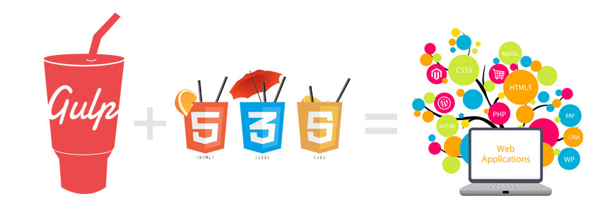

# TEMPLATE HTML - fast built
gulp: html, css, js, create sprite and svg to fonts

## Installation

Before running any Gulp tasks:

1. Check out this repository
2. Ensure you have **node** installed
3. Run `npm run go` in the root directory
4. Open link http://localhost:8000

## Project Structure

    /root
    |---- package.json
    |---- gulpfile.js
    |---- jspm.config.js
    |---- _icons_template.css.tmpl
    |---- /html
    |     |---- index.html
    |     |---- main.html
    |     |---- /js
    |     |     |---- vendor.js
    |     |     |---- jquery.main.js
    |     |---- /css
    |     |     /---- /scss
    |     |     |---- main.css
    |     |     |---- vendor.css
    |     |---- /img
    |     |     |---- /icons-for-sprite
    |     |     |---- /svg-for-font
    |---- /mail_html
    |     |---- index.html
    |     |---- /img

